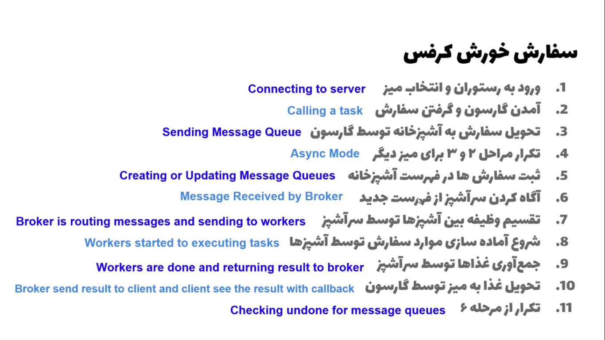

For firing up this program you have to first download and start rabbitMQ, if you are using linux like me so your live is easy just all you need to do is run this command ` sudo apt-get rabbitmq-server`  then you have to enable it `sudo systemctl enable rabbitmq-server` and start with `sudo systemctl start rabbitmq-server` that's it for rabbit. then you have to install requirements.txt with `pip install -r requirements.txt` 

برای درک بهتر شما یک عکس را هم آماده کردم از اینکه سلری با ربت ام کیو یا ریدیس چگونه کار می کند.
برای درک بهتر شما یک رستورانت را در نظر بگرید که برای مشتریانش سرویس اراپه می کند. که خود این یک نمونه خوبی از مثال استفاده سلری می باشد

